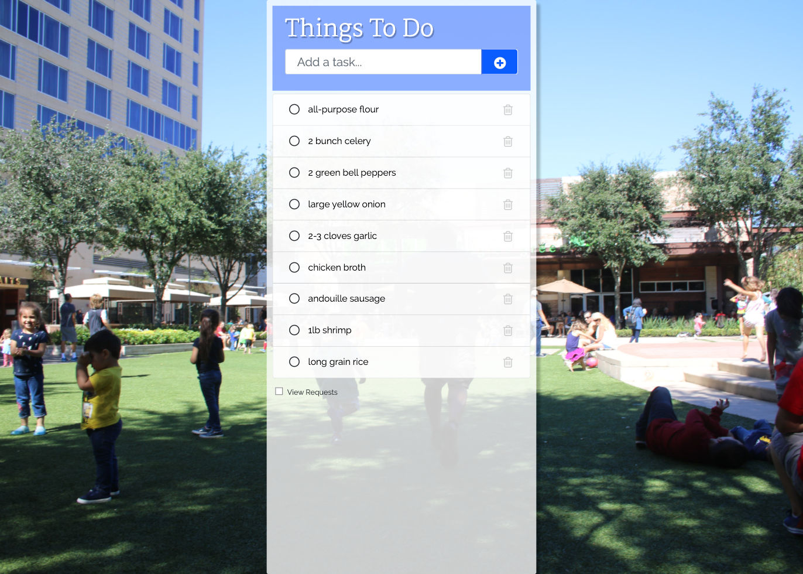
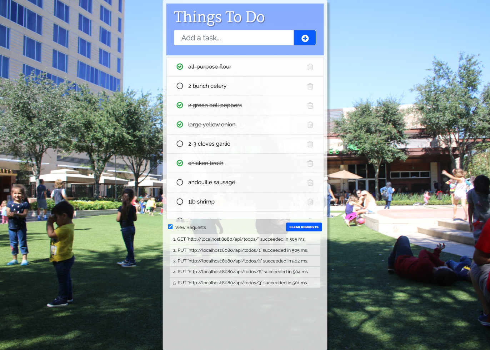

  

<h1 align="center">Angular 9 Todo List using In-Memory-web-api</h1>
This is my Angular 9 CRUD application.  It is a basic Todo app that uses the in-memory-web-api to replicate calls.  
  
This app also includes Bootstrap 4(scss) and Prettier. It uses the messaging service from Angular's Tour of Heroes tutorial to show api requests.  

  

  

## ❯ Resources

* https://www.techiediaries.com/angular-inmemory-web-api/ - This one got me started but did not give a complete view of how data is updated to the app. 

* https://www.concretepage.com/angular/angular-crud - This worked great, I based initial requests from this repo.

* http://www.angulartodo.com/code.html  - I used this example to help simplify my form. 

* https://www.youtube.com/watch?v=jNCzuSryJHE  - I used this as a basis for styling.  

* https://stackblitz.com/angular/vnyxovpppxr?file=src%2Fapp%2Fhttp-error-handler.service.ts - google's official implementation but I ended up using their error handling and messaging features.

* https://angular.io/guide/http - Angular Docs
https://github.com/angular/in-memory-web-api - In Memory Web Api documentation

Thanks for stopping by! 

This project was generated with [Angular CLI](https://github.com/angular/angular-cli) version 9.1.1.

## Development server

Run `ng serve` for a dev server. Navigate to `http://localhost:4200/`. The app will automatically reload if you change any of the source files.

## Code scaffolding

Run `ng generate component component-name` to generate a new component. You can also use `ng generate directive|pipe|service|class|guard|interface|enum|module`.

## Build

Run `ng build` to build the project. The build artifacts will be stored in the `dist/` directory. Use the `--prod` flag for a production build.

## Running unit tests

Run `ng test` to execute the unit tests via [Karma](https://karma-runner.github.io).

## Running end-to-end tests

Run `ng e2e` to execute the end-to-end tests via [Protractor](http://www.protractortest.org/).

## Further help

To get more help on the Angular CLI use `ng help` or go check out the [Angular CLI README](https://github.com/angular/angular-cli/blob/master/README.md).
